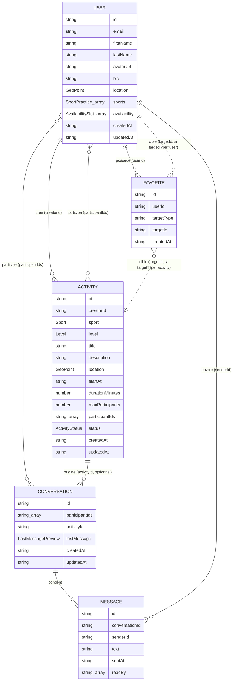

# BINOFIT — Diagramme du modèle de données

Diagramme Entité-Association correspondant au modèle décrit dans `/specs/data-model.md`.

## Notes de lecture

- `USER ||--o{ ACTIVITY` : un utilisateur peut créer plusieurs activités (relation 1—N via `creatorId`).
- `USER }o--o{ ACTIVITY` : relation N—N de participation (`activities.participantIds`).
- `USER }o--o{ CONVERSATION` : une conversation a plusieurs participants, un utilisateur a plusieurs conversations.
- `ACTIVITY ||--o{ CONVERSATION` : une conversation peut optionnellement découler d'une activité (`conversations.activityId`).
- `CONVERSATION ||--o{ MESSAGE` : une conversation contient plusieurs messages (stockés dans Firebase Realtime Database).
- `FAVORITE` cible soit un `USER`, soit une `ACTIVITY`, selon `targetType` (relation polymorphe représentée par les deux liens en pointillés).

## Répartition par base de données

| Entité          | Base de données                                                  |
| ---------------- | ----------------------------------------------------------------- |
| `User`         | Firebase Firestore (`users`)                                    |
| `Activity`     | Firebase Firestore (`activities`)                               |
| `Favorite`     | Firebase Firestore (`favorites`)                                |
| `Conversation` | Firebase Firestore (`conversations`) — métadonnées seulement |
| `Message`      | Firebase Realtime Database (`messages/{conversationId}`)        |
