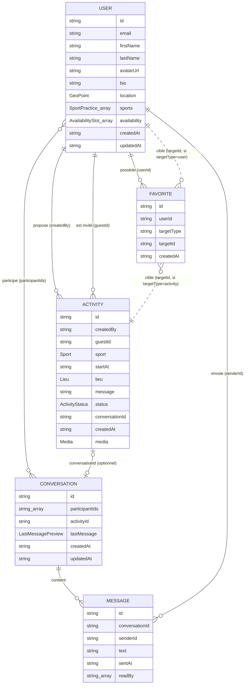

# BINOFIT — Diagramme du modèle de données

Diagramme Entité-Association correspondant au modèle décrit dans `/specs/data-model.md`.

## Notes de lecture

- `USER ||--o{ ACTIVITY` (propose) : un utilisateur peut créer plusieurs activités, en tant que créateur (`createdBy`).
- `USER ||--o{ ACTIVITY` (est invité) : un utilisateur peut recevoir plusieurs propositions, en tant qu'invité (`guestId`) — chaque activité n'a qu'un seul créateur et un seul invité, jamais de liste de participants.
- `USER }o--o{ CONVERSATION` : une conversation a plusieurs participants, un utilisateur a plusieurs conversations.
- `ACTIVITY |o--o| CONVERSATION` : une activité peut optionnellement avoir une conversation associée (`activities.conversationId`), et réciproquement (`conversations.activityId`) — relation 1—1 optionnelle, dupliquée des deux côtés car Firestore ne permet pas les jointures.
- `CONVERSATION ||--o{ MESSAGE` : une conversation contient plusieurs messages (stockés dans Firebase Realtime Database).
- `FAVORITE` cible soit un `USER`, soit une `ACTIVITY`, selon `targetType` (relation polymorphe représentée par les deux liens en pointillés).

## Répartition par base de données

| Entité          | Base de données                                                  |
| ---------------- | ----------------------------------------------------------------- |
| `User`         | Firebase Firestore (`users`)                                    |
| `Activity`     | Firebase Firestore (`activities`)                               |
| `Favorite`     | Firebase Firestore (`favorites`)                                |
| `Conversation` | Firebase Firestore (`conversations`) — métadonnées seulement |
| `Message`      | Firebase Realtime Database (`messages/{conversationId}`)        |
